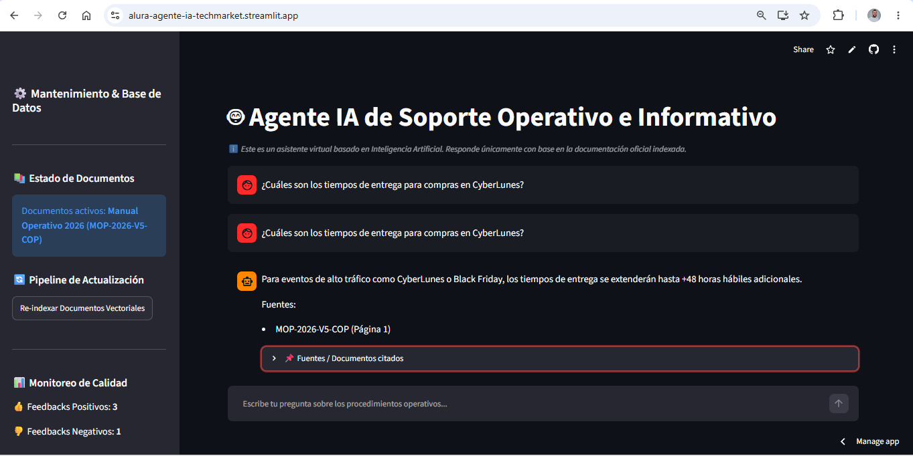
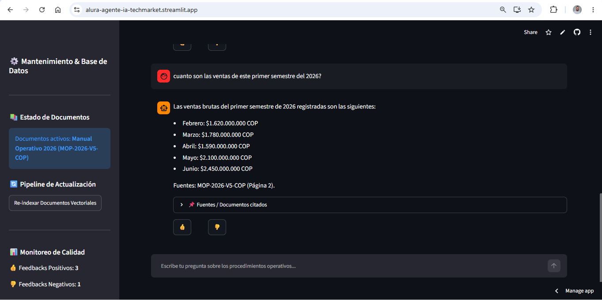
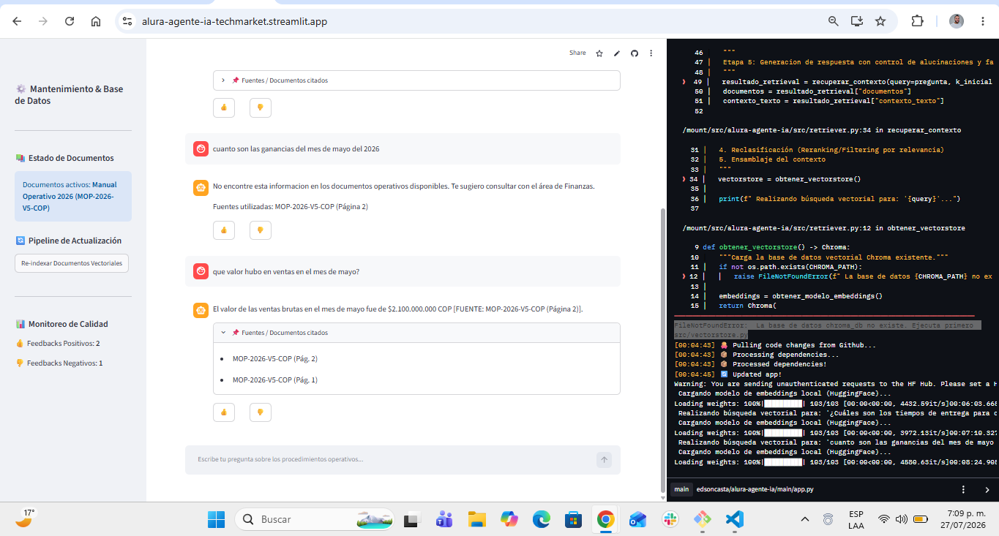

# 🤖 Agente IA de Soporte Operativo e Informativo

Un asistente virtual inteligente basado en **Arquitectura RAG (Retrieval-Augmented Generation)** desarrollado para responder consultas operativas y comerciales con base en la documentación oficial de la empresa, garantizando respuestas precisas y control de alucinaciones.

🔗 **Demo en Producción:** [https://alura-agente-ia-techmarket.streamlit.app](https://alura-agente-ia-techmarket.streamlit.app)

---

## 📸 Vista Previa del Sistema

| Interfaz y Búsqueda Semántica | Desglose de Respuestas y Métricas | Registro de Ejecución y Terminal |
| :---: | :---: | :---: |
|  |  |  |

---

## 🛠️ Tecnologías Utilizadas

* **Lenguaje:** Python 3.10+
* **Framework Web:** Streamlit
* **Modelo LLM:** Google Gemini API (`gemini-flash-lite-latest`)
* **Framework de IA:** LangChain (`langchain-google-genai`, `langchain-chroma`, `langchain-huggingface`)
* **Embeddings:** `sentence-transformers/all-MiniLM-L6-v2` (Modelo multilingüe local)
* **Base de Datos Vectorial:** ChromaDB
* **Procesamiento de Documentos:** PyPDF
* **Entorno & Despliegue:** Streamlit Community Cloud & GitHub CI/CD

---

## 🏗️ Arquitectura del Sistema (RAG Pipeline)

1. **Ingestión y Carga:** Carga de documentos operativos en formato PDF (`data/`).
2. **Chunking & Indexación:** Segmentación de texto en fragmentos optimizados (*chunks*) con solapamiento (*overlap*).
3. **Embeddings Locales:** Generación de vectores densos utilizando HuggingFace Transformers.
4. **Almacenamiento Vectorial:** Persistencia de embeddings y metadatos en **ChromaDB**.
5. **Recuperación Semántica:** Búsqueda por similitud de coseno para extraer los fragmentos más relevantes ante la consulta del usuario.
6. **Generación Aumentada (LLM):** Inyección del contexto recuperado en el Prompt de **Google Gemini** obligando al modelo a responder estrictamente con base en las fuentes o activar una respuesta de reserva (*fallback*).

---

## 📂 Estructura del Proyecto

```text
Alura-Agente-IA/
├── data/                      # Documentos PDF a indexar
├── docs/                      # Evidencias multimedia de ejecución en la nube
├── src/
│   ├── loader.py              # Carga y segmentación de documentos PDF
│   ├── vectorstore.py         # Creación y gestión de la base ChromaDB
│   ├── retriever.py           # Recuperación de contexto semántico
│   └── generator.py           # Integración con Google Gemini (RAG)
├── app.py                     # Interfaz web principal con Streamlit
├── chroma_db/                 # Base de datos vectorial persistente
├── .env.example               # Plantilla de variables de entorno
├── requirements.txt           # Dependencias del proyecto
└── README.md                  # Documentación oficial
```
# 🚀 Instalación y Ejecución Local
### 1. Clonar el repositorio
```
Bash

git clone [https://github.com/EdsonCasta/Alura-Agente-IA.git](https://github.com/EdsonCasta/Alura-Agente-IA.git)
cd Alura-Agente-IA
```
### 2. Crear y activar entorno virtual
```
Bash

# Windows
python -m venv .venv
.venv\Scripts\activate

# Linux/Mac
python3 -m venv .venv
source .venv/bin/activate
```

### 3. Instalar dependencias
```
Bash

pip install -r requirements.txt
```
### 4. Configurar variables de entorno
Crea un archivo `.env` en la raíz basado en `.env.example`:
```
Fragmento de código

GEMINI_API_KEY=tu_api_key_de_google_gemini
```

### 5. Ejecutar la aplicación
```
Bash

streamlit run app.py
```

# 📊 Registro de Ejecución, Trazabilidad
El sistema cuenta con un pipeline de observabilidad y auditoría desplegado en producción:

Centralización de Logs: Streamlit Cloud registra la salida estándar (`stdout/stderr`), capturando marcas de tiempo, descargas de modelos y búsquedas vectoriales en tiempo real.

Control de Calidad: Implementación de métricas de retroalimentación de usuario (👍 / 👎) integradas en el estado de la sesión (`st.session_state`).

CI/CD Continuo: Integración directa con GitHub; cada actualización en la rama `main` realiza la construcción y despliegue automático del agente.

# ✒️ Autor
Edson Castañeda – Software Developer – GitHub
